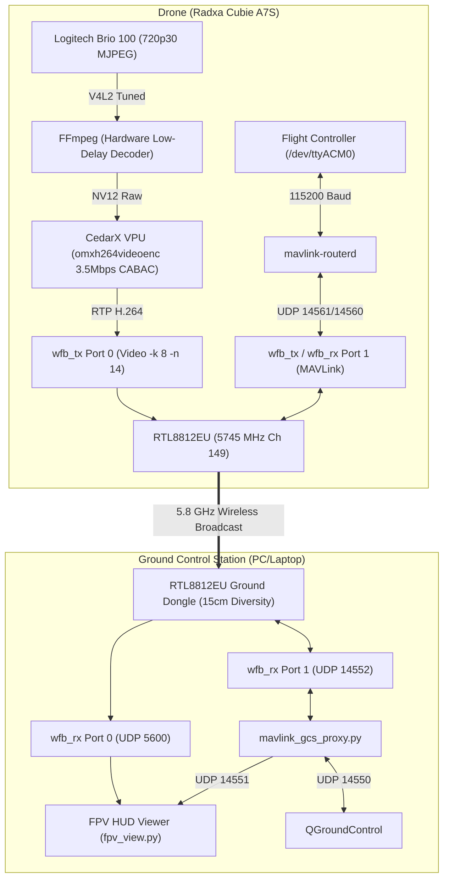

# Radxa Cubie A7S Digital FPV System (WFB-ng)

An ultra-low latency (<40ms), broadcast-grade digital FPV video and bidirectional MAVLink telemetry system built on the **Radxa Cubie A7S** (Allwinner A527 Octa-core Cortex-A55 SBC), **Logitech Brio 100**, and **RTL8812EU (BL-M8812EU2)** using **WFB-ng**.

---

## Highlights & Specifications

| Feature | Specification |
| :--- | :--- |
| **Video Resolution & Framerate** | **1280 × 720 @ 30.0 FPS** (Locked real-time clock, zero drift) |
| **Video Encoding** | **CedarX VPU Hardware H.264 (CABAC High Profile)** |
| **Bitrate** | **3.5 Mbps** (Near-lossless 0.126 Bits-Per-Pixel) |
| **Keyframe Interval** | Periodicity IDR = 15 (0.5s fast recovery) |
| **RF Channel & Modulation** | **5.8 GHz Channel 149 (5745 MHz)**, 20 MHz Bandwidth, **MCS 2** |
| **Error Correction** | **Reed-Solomon FEC (8, 14)** — recovers up to 43% packet loss |
| **Telemetry** | Full **Bidirectional MAVLink** (ArduPilot / PX4 ↔ QGroundControl 14550) |
| **Ground HUD** | Python / Pygame FPV viewer with **16:9 scaling, horizon HUD, RSSI meter** |
| **Air Unit Thermals** | **~47°C** under continuous encode, **< 15% CPU load** |

---

## Architecture Diagram



---

## Hardware Setup & Critical Wiring

### 1. The 5A Buck Converter + Low-ESR Capacitor (Mandatory)
* **The Challenge**: During 3.5 Mbps packet bursts (pushing ~715 packets/s), the RTL8812EU dual Power Amplifiers draw rapid **1.8A to 2.5A current spikes**. Weak 2A–3A BECs suffer micro-voltage sags that degrade transmitter EVM (Error Vector Magnitude), causing cyclic packet loss.
* **The Solution**: Use a dedicated **5A 5V buck converter** with a **470 µF to 1000 µF Low-ESR electrolytic capacitor** (e.g. Rubycon ZLH / Panasonic FR) and a **0.1 µF ceramic capacitor** soldered across the 5V and GND outputs.

### 2. Antenna Spacing & Diversity
* Operating at 5745 MHz, wavelength $\lambda \approx 5.2\text{ cm}$.
* A **15 cm physical separation** between the two antennas ($~3\lambda$) guarantees complete spatial decorrelation. Multipath nulls or shadow zones affecting one antenna will not affect the other, allowing hardware Maximal Ratio Combining (MRC) to provide **3 dB to 5 dB clean SNR gain**.

---

## Sensor Tuning for Logitech Brio 100

Webcams operating outdoors in FPV flight require specialized V4L2 tuning to prevent ground underexposure against bright skies and to maximize detail:

```bash
# Apply Aerial Tuning:
v4l2-ctl -d /dev/video0 --set-ctrl=exposure_dynamic_framerate=0 # Strict 30 fps lock
v4l2-ctl -d /dev/video0 --set-ctrl=auto_exposure=3              # Aperture Priority
v4l2-ctl -d /dev/video0 --set-ctrl=backlight_compensation=1    # Prevents dark ground silhouette
v4l2-ctl -d /dev/video0 --set-ctrl=brightness=132              # Lifts terrain shadows
v4l2-ctl -d /dev/video0 --set-ctrl=contrast=142                # Separates clouds, horizon, and terrain
v4l2-ctl -d /dev/video0 --set-ctrl=saturation=145              # Rich FPV colors (grass, sky, markers)
v4l2-ctl -d /dev/video0 --set-ctrl=sharpness=165               # Crisp edges on branches and wires
v4l2-ctl -d /dev/video0 --set-ctrl=power_line_frequency=1      # 50 Hz anti-flicker
```

---

## Installation & Quick Start

### Air Unit (Drone — Radxa Cubie A7S)

1. **Install Prerequisites**:
   ```bash
   sudo apt update
   sudo apt install -y gstreamer1.0-tools gstreamer1.0-plugins-base gstreamer1.0-plugins-good \
                       gstreamer1.0-plugins-bad ffmpeg v4l-utils libsodium-dev
   ```

2. **Copy Scripts & Keys**:
   Place `drone/start_drone.sh`, `drone/stop_drone.sh`, and `drone/mavlink-router.conf` into `/home/radxa/wfb-ng/`.
   Ensure `drone.key` is placed in `/home/radxa/wfb-ng/drone.key`.

3. **Launch VTX**:
   ```bash
   sudo /home/radxa/wfb-ng/start_drone.sh
   # Or run via systemd:
   sudo systemd-run --unit=drone-vtx /home/radxa/wfb-ng/start_drone.sh
   ```

---

### Ground Station (GCS — Laptop / PC)

1. **Install Prerequisites**:
   ```bash
   sudo apt update
   sudo apt install -y python3-pygame python3-pip python3-gst-1.0 gstreamer1.0-plugins-good \
                       gstreamer1.0-plugins-bad gstreamer1.0-libav libsodium-dev iw
   pip install pymavlink
   ```

2. **Copy Scripts & Keys**:
   Place `gcs/start_gs.sh`, `gcs/stop_gs.sh`, `gcs/mavlink_gcs_proxy.py`, and `gcs/fpv_view.py` into `/home/$USER/wfb-ng/`.
   Ensure `gs.key` is placed in `/home/$USER/wfb-ng/gs.key`.

3. **Start Ground Station**:
   ```bash
   sudo /home/$USER/wfb-ng/start_gs.sh -d
   ```

4. **Launch FPV HUD Viewer**:
   ```bash
   python3 /home/$USER/wfb-ng/fpv_view.py
   ```
   * Press `F` to toggle Fullscreen (auto letterboxing to maintain 16:9).
   * Press `O` to cycle OSD modes (Full, Minimal, Clean).
   * Press `Q` or `Esc` to quit.

5. **Connect QGroundControl**:
   Open QGroundControl. It will automatically detect telemetry on `UDP 127.0.0.1:14550`.

---

## Directory Structure

```text
Radxa-Cubie-Digital-FPV/
├── drone/
│   ├── start_drone.sh         # VTX pipeline (CedarX 3.5Mbps, sensor tuning, WFB-ng TX)
│   ├── stop_drone.sh          # Drone shutdown script
│   └── mavlink-router.conf    # MAVLink router configuration
├── gcs/
│   ├── start_gs.sh            # Ground Station startup script (RTL8812EU monitor mode, WFB-ng RX)
│   ├── stop_gs.sh             # GCS shutdown script
│   ├── mavlink_gcs_proxy.py   # Multi-client UDP proxy (QGC 14550 + FPV 14551)
│   └── fpv_view.py            # Pygame FPV OSD viewer (Horizon bar, RSSI, telemetry)
├── driver/
│   ├── 8812eu.conf            # Optimized module parameters for RTL8812EU
│   └── README.md              # Driver installation & build guide
├── keys/
│   ├── README.md              # Key generation guide (wfb_keygen)
│   ├── drone.key.sample       # Sample paired keys
│   └── gs.key.sample
├── tools/
│   ├── sensor_tune.sh         # Standalone Brio 100 tuning script
│   ├── check_camera_live.sh   # Camera feed test script
│   ├── sensor_check.py        # V4L2 diagnostic tool
│   ├── deep_sensor_check.py   # Extended sensor register inspector
│   └── monitor_power.py       # Power consumption monitor
└── npu-experimental/          # Preserved AI/YOLOv8 tracking scripts & models
    ├── drone_yolov8n_tracker.cpp
    ├── drone_yolov8n_tracker.py
    ├── drone_npu_tracker.py
    └── yolov8n_*.nb
```

---

## License

GPLv3 License — see LICENSE for details.
