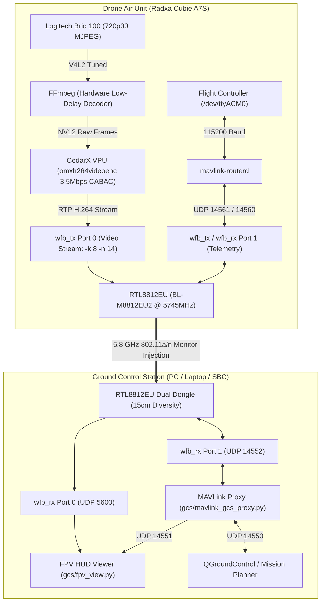

# Radxa-Cubie-Digital-FPV

An open-source, ultra-low latency (<40ms), broadcast-grade digital FPV video and bidirectional MAVLink telemetry system built on the **Radxa Cubie A7S** (Allwinner A527 Octa-core Cortex-A55 SBC), **Logitech Brio 100**, and **RTL8812EU (BL-M8812EU2)** wireless transceivers using **WFB-ng**.

---

## Highlights & Specifications

| Category | Specification | Details / Rationale |
| :--- | :--- | :--- |
| **Video Resolution** | **1280 × 720 @ 30.0 FPS** | 2×2 on-sensor pixel binning (4× light sensitivity, zero frame drops) |
| **Video Encoding** | **CedarX VPU H.264 (CABAC High Profile)** | Allwinner Hardware OMX encoder via `omxh264videoenc` |
| **Video Bitrate** | **3.5 Mbps** (CBR) | 0.126 Bits-per-Pixel; razor-sharp foliage and terrain separation |
| **Keyframe Interval** | **Periodicity IDR = 15** | Keyframe every 0.5s for instant signal recovery after occlusion |
| **RF Channel & Freq** | **Channel 149 (5745 MHz)** | Clean 5.8 GHz ISM band, 20 MHz channel width |
| **RF Modulation** | **MCS 2 (QPSK, 19.5 Mbps link rate)** | Optimal sweet-spot for long range and high packet reception rate |
| **Forward Error Correction** | **Reed-Solomon FEC (8, 14)** | WFB-ng FEC recovers up to 43% packet loss with zero latency penalty |
| **Telemetry** | **Full Bidirectional MAVLink** | ArduPilot / PX4 ↔ QGroundControl (UDP 14550) & FPV HUD (UDP 14551) |
| **Ground HUD** | **Python / Pygame HUD Viewer** | Artificial horizon, RSSI dbm, packet loss rate, battery voltage, flight mode |
| **Air Unit Thermals** | **~47°C continuous** | Hardware VPU encoding consumes **< 15% CPU load** across 8 cores |

---

## Architecture Diagram



---

## Hardware Setup & Critical Wiring

### 1. Power Supply: Dedicated 5A Buck Converter + Low-ESR Capacitor
> [!IMPORTANT]
> Standard 2A–3A flight controller BECs or direct USB 5V supplies will cause intermittent link degradation and cyclic frame drops.
* **Why**: The RTL8812EU wireless module with dual integrated Power Amplifiers draws rapid transient spikes between **1.8A and 2.5A** during 3.5 Mbps burst transmissions (~715 packets/s). Micro-voltage sags below 4.75V cause the transmitter's Error Vector Magnitude (EVM) to collapse, resulting in sudden RF packet loss even at close range.
* **Recommended Setup**:
  - Dedicated **5V 5A Buck Converter** powered directly from the main LiPo battery (2S–6S).
  - Solder a **470 µF to 1000 µF Low-ESR Electrolytic Capacitor** (e.g. Rubycon ZLH / Panasonic FR) directly across the 5V and GND output rails.
  - Solder a **0.1 µF (100nF) ceramic decoupling capacitor** in parallel with the electrolytic capacitor to filter high-frequency switching noise.

### 2. Antenna Diversity Spacing
* Operating frequency: 5745 MHz ($\lambda \approx 5.2\text{ cm}$).
* Maintain **at least 15 cm physical separation** between the two antennas ($~3\lambda$).
* This spacing prevents spatial coupling and ensures true spatial decorrelation. When one antenna experiences a multipath null, the other remains clear, enabling the RTL8812EU hardware Maximal Ratio Combining (MRC) receiver to provide **3 dB to 5 dB of clean SNR gain**.

---

## Logitech Brio 100 Aerial Sensor Tuning

Standard webcam auto-exposure settings are tuned for indoor face-lighting, causing sky overexposure and washed-out or completely black ground terrain when mounted on an aircraft.

The included tuning parameters configure the sensor specifically for aerial FPV flight:

```bash
# 1. Disable dynamic framerate drops under changing sunlight
v4l2-ctl -d /dev/video0 --set-ctrl=exposure_dynamic_framerate=0

# 2. Set auto-exposure to Aperture Priority Mode
v4l2-ctl -d /dev/video0 --set-ctrl=auto_exposure=3

# 3. Enable backlight compensation (prevents ground from becoming a black silhouette against the sky)
v4l2-ctl -d /dev/video0 --set-ctrl=backlight_compensation=1

# 4. Lift terrain shadows while maintaining horizon distinction
v4l2-ctl -d /dev/video0 --set-ctrl=brightness=132
v4l2-ctl -d /dev/video0 --set-ctrl=contrast=142

# 5. Enhance color saturation for natural grass, sky, and obstacle visibility
v4l2-ctl -d /dev/video0 --set-ctrl=saturation=145

# 6. Edge sharpening for wires, branches, and gates
v4l2-ctl -d /dev/video0 --set-ctrl=sharpness=165

# 7. Anti-flicker frequency filter (50 Hz / 60 Hz)
v4l2-ctl -d /dev/video0 --set-ctrl=power_line_frequency=1
```
*(These settings are automatically applied at startup by `drone/start_drone.sh`)*.

---

## Installation & Quick Start

### Step 1: Clone Repository
```bash
git clone https://github.com/RiteshKumarRay/Radxa-Cubie-Digital-FPV.git
cd Radxa-Cubie-Digital-FPV
```

### Step 2: Generate WFB-ng Encryption Keys
Paired encryption keys must be generated once and shared between the Air Unit and Ground Station:

```bash
cd keys/
chmod +x generate_keys.sh
./generate_keys.sh
```
This generates:
* `drone.key`: Copy to your Drone Air Unit at `/home/<USER>/wfb-ng/drone.key`
* `gs.key`: Copy to your Ground Station at `/home/<USER>/wfb-ng/gs.key`

---

### Step 3: Drone Air Unit Setup (Radxa Cubie A7S)

1. **Install Prerequisites**:
   ```bash
   sudo apt update
   sudo apt install -y gstreamer1.0-tools gstreamer1.0-plugins-base gstreamer1.0-plugins-good \
                       gstreamer1.0-plugins-bad ffmpeg v4l-utils libsodium-dev libpcap-dev
   ```

2. **Deploy Scripts**:
   ```bash
   mkdir -p ~/wfb-ng
   cp drone/start_drone.sh drone/stop_drone.sh drone/mavlink-router.conf ~/wfb-ng/
   cp keys/drone.key ~/wfb-ng/
   chmod +x ~/wfb-ng/*.sh
   ```

3. **Install RTL8812EU Driver**:
   Follow instructions in `driver/README.md` to compile and install the high-power RTL8812EU driver, and copy `driver/8812eu.conf` to `/etc/modprobe.d/8812eu.conf`.

4. **Launch VTX (Manual / Testing)**:
   ```bash
   sudo ~/wfb-ng/start_drone.sh
   ```

5. **Auto-Start on Boot (Systemd Service)**:
   ```bash
   sudo systemd-run --unit=drone-vtx --remain-after-exit ~/wfb-ng/start_drone.sh
   ```

---

### Step 4: Ground Control Station Setup (PC / Laptop)

1. **Install Prerequisites**:
   ```bash
   sudo apt update
   sudo apt install -y python3-pygame python3-pip python3-gst-1.0 gstreamer1.0-plugins-good \
                       gstreamer1.0-plugins-bad gstreamer1.0-libav libsodium-dev libpcap-dev iw
   pip install pymavlink
   ```

2. **Deploy Scripts**:
   ```bash
   mkdir -p ~/wfb-ng
   cp gcs/start_gs.sh gcs/stop_gs.sh gcs/mavlink_gcs_proxy.py gcs/fpv_view.py ~/wfb-ng/
   cp keys/gs.key ~/wfb-ng/
   chmod +x ~/wfb-ng/*.sh
   ```

3. **Start Ground Station**:
   ```bash
   sudo ~/wfb-ng/start_gs.sh -d
   ```

4. **Launch FPV HUD Viewer**:
   ```bash
   python3 ~/wfb-ng/fpv_view.py
   ```
   **Keyboard Shortcuts**:
   * `F` — Toggle Fullscreen (automatic letterboxing to preserve 16:9 aspect ratio)
   * `O` — Cycle OSD display modes (Full HUD, Minimal, Clean)
   * `Q` or `Esc` — Quit viewer

5. **Connect Mission Planner / QGroundControl**:
   Open QGroundControl. It will automatically detect telemetry via the internal proxy on `UDP 127.0.0.1:14550`.

---

## Directory Structure

```text
Radxa-Cubie-Digital-FPV/
├── drone/
│   ├── start_drone.sh         # Drone Air Unit startup (CedarX 3.5Mbps, sensor tuning, WFB-ng TX)
│   ├── stop_drone.sh          # Drone clean shutdown script
│   └── mavlink-router.conf    # MAVLink routing between FC serial and WFB-ng UDP ports
├── gcs/
│   ├── start_gs.sh            # GCS startup script (RTL8812EU monitor mode, WFB-ng RX)
│   ├── stop_gs.sh             # GCS shutdown script
│   ├── mavlink_gcs_proxy.py   # Multi-client UDP MAVLink proxy (QGC 14550 + FPV HUD 14551)
│   └── fpv_view.py            # Pygame FPV viewer (16:9 scaling, horizon HUD, RSSI meter)
├── driver/
│   ├── 8812eu.conf            # Optimized kernel module parameters for RTL8812EU
│   └── README.md              # RTL8812EU driver installation and configuration guide
├── keys/
│   ├── generate_keys.sh       # One-click cryptographic key pair generation script
│   ├── README.md              # Key management instructions
│   ├── drone.key.sample       # Sample paired key for reference
│   └── gs.key.sample
├── tools/
│   ├── sensor_tune.sh         # Standalone Logitech Brio 100 aerial tuning script
│   ├── check_camera_live.sh   # Direct camera feed latency and capability tester
│   ├── sensor_check.py        # Serial and flight controller diagnostic utility
│   ├── deep_sensor_check.py   # Extended sensor register inspector
│   ├── monitor_power.py       # Voltage and power consumption monitor
│   └── reset_camera.sh        # USB bus reset helper for USB cameras
└── npu-experimental/          # Onboard AI tracking (YOLOv8n on Allwinner VIP9000 NPU)
    ├── drone_yolov8n_tracker.cpp # Low-latency C++ NPU inference and tracker
    ├── drone_yolov8n_tracker.py  # Python NPU inference wrapper
    ├── drone_npu_tracker.py      # Standalone NPU object detector
    ├── deploy_yolov8n_to_drone.sh# Deployment script to sync models to Air Unit
    ├── build_tracker_cpp.sh      # Compilation script for C++ tracker
    ├── yolov8n_384x640_a733.nb   # Quantized NB model for Allwinner A733
    └── yolov8n_384x640_t527.nb   # Quantized NB model for Allwinner T527
```

---

## Troubleshooting & FAQ

### 1. Wi-Fi Card Enters RF-OFF State (`txpower -100 dBm`)
* **Cause**: When re-plugging the RTL8812EU dongle, the Realtek driver may trigger internal hardware power-down (`rtw_hwpdn_mode=1`).
* **Fix**: Ensure `/etc/modprobe.d/8812eu.conf` includes `rtw_hwpdn_mode=0`. The `gcs/start_gs.sh` script automatically detects and reloads the driver with this parameter if the card enters a low-power lockup.

### 2. `iw dev set monitor otherbss` Fails with `Operation not permitted (-1)`
* **Cause**: Attempting to switch interface modes immediately after setting the interface `down` before the kernel driver finishes flushing buffers.
* **Fix**: `start_gs.sh` includes a verified 1.5s settling delay between interface state transitions to prevent this race condition.

### 3. Flight Controller Port Auto-Detection
* `drone/start_drone.sh` automatically scans for available serial ports in `/dev/ttyACM0`, `/dev/ttyACM1`, `/dev/ttyUSB0`, and `/dev/ttyUSB1`.
* To force a specific device, set the environment variable before running:
  ```bash
  export FC_DEVICE=/dev/ttyACM0
  export FC_BAUD=115200
  sudo -E ~/wfb-ng/start_drone.sh
  ```

---

## License

This project is licensed under the [GNU General Public License v3.0](LICENSE).
